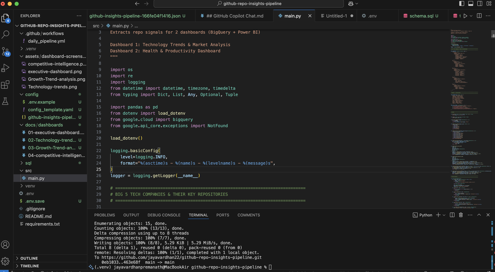
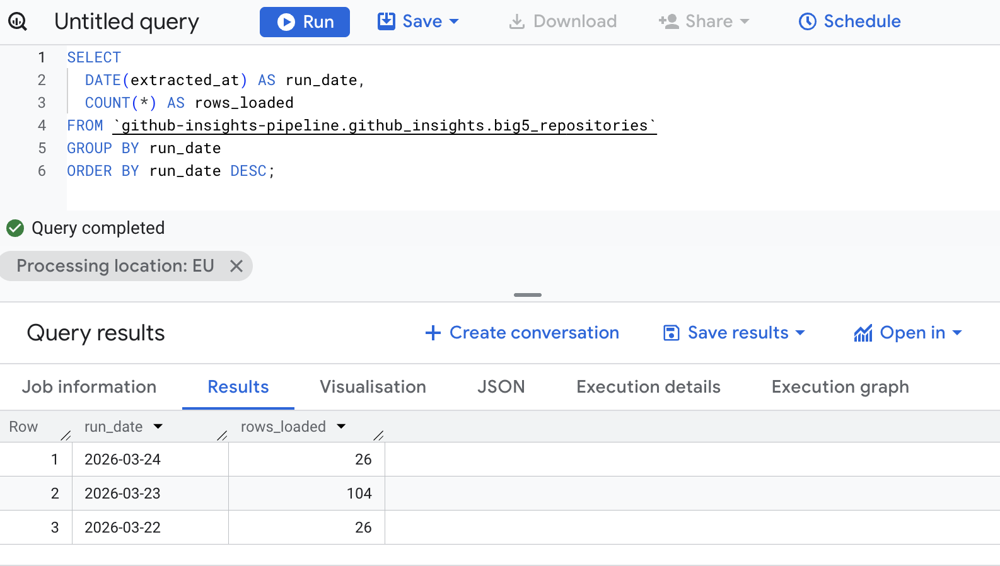
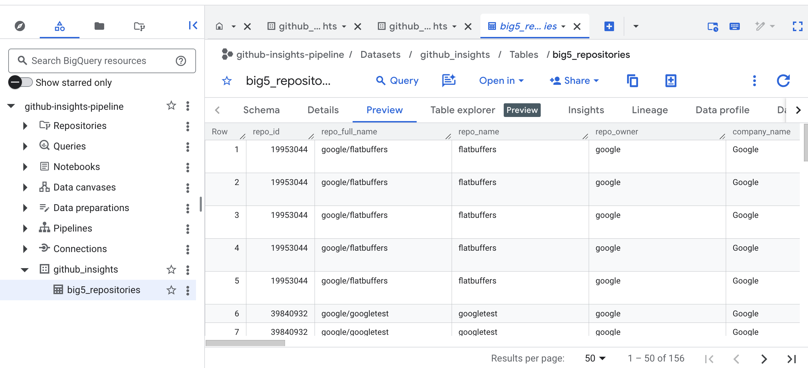

# 📊 GitHub Intelligence Dashboard — Big 5 Tech Companies


> **Enterprise-grade analytics platform tracking open-source strategy, market trends, and competitive positioning of Big 5 tech companies (Google, Meta, Microsoft, Amazon, Apple)**

---

## 🎯 Overview

**GitHub Intelligence Dashboard** is an automated data pipeline that collects, analyzes, and visualizes GitHub repository metrics from the world's largest tech companies.

| Capability | Details |
|---|---|
| 🔧 Data Engineering | ETL pipeline with automated daily updates |
| 📊 Business Intelligence | 4 professional Power BI dashboards |
| 📈 Analytics | Real-world insights from 40+ repositories |
| ⚙️ DevOps | GitHub Actions automation |
| ☁️ Cloud | Google BigQuery data warehouse |

---

## 📊 Live Interactive Dashboards

### [Executive Dashboard](https://app.powerbi.com/reportEmbed?reportId=f258e380-b83e-483f-87a7-bce909d9e0ea&autoAuth=true&ctid=5d0aa6ea-6620-4863-9e21-9ecb140222bc)
High-level market overview • Company rankings • Star distribution

### [Technology Trends & Market Analysis](https://app.powerbi.com/reportEmbed?reportId=f258e380-b83e-483f-87a7-bce909d9e0ea&autoAuth=true&ctid=5d0aa6ea-6620-4863-9e21-9ecb140222bc)
Language market share • Emerging technologies • Growth trends

### [Growth & Trend Analysis](https://app.powerbi.com/reportEmbed?reportId=f258e380-b83e-483f-87a7-bce909d9e0ea&autoAuth=true&ctid=5d0aa6ea-6620-4863-9e21-9ecb140222bc)
Repository growth rates • Velocity metrics • 12-month predictions

### [Competitive Intelligence & Strategy](https://app.powerbi.com/reportEmbed?reportId=f258e380-b83e-483f-87a7-bce909d9e0ea&autoAuth=true&ctid=5d0aa6ea-6620-4863-9e21-9ecb140222bc)
Company tech stacks • Market positioning • Strategic insights

---

## 📋 Dashboard Details

### 1. Executive Dashboard 📈
High-level overview of market performance across all companies.

**Key Metrics:** 40+ repositories · 2.7M+ total stars · 12.8 yr avg maturity · 5 companies tracked

**Visuals:** KPI Cards · Stars Distribution by Company · Repo Count by Company · Top 10 Leaderboard

📖 [Full Documentation](docs/dashboards/01-executive-dashboard.md)

---

### 2. Language Trends & Market Analysis 🔥
Deep dive into technology adoption and market trends.

**Key Insights:** Most popular: JavaScript (244K+ stars) · Most used: C# (26 repos) · Fastest growing: Rust, TypeScript, Go

**Visuals:** Stars by Language · Repo Count by Language · Technology Momentum Score · Popularity vs Activity Scatter · Language Filtering

📖 [Full Documentation](docs/dashboards/02-language-trends.md)

---

### 3. Growth & Trend Analysis 🚀
Analytical deep-dive showing repository momentum and trajectory.

**Key Metrics:** Avg Growth Potential: 95.89/100 · Momentum Score: 89.30/100 · Avg Stars/Year: 4.50K · Top Repo: googletest

**Visuals:** Growth Potential by Repo · Stars Growth Rate by Company · Top Growth Repos Table · Activity Status Tracking

📖 [Full Documentation](docs/dashboards/03-growth-analysis.md)

---

### 4. Competitive Intelligence 🏆
Strategic positioning and competitive analysis.

**Key Insights:** 5 companies · 2M+ total market stars · 19.29 yr avg repo age · 2–4 languages per company

**Visuals:** Market Position Matrix · Technology Diversity Score · Competitive Analysis Table · Strategic Positioning Insights

📖 [Full Documentation](docs/dashboards/04-competitive-intelligence.md)

---

## 🏗️ Architecture

```
┌──────────────────────────────────────┐
│        Power BI Dashboards           │
│   (4 Professional Analytics Views)   │
└─────────────────┬────────────────────┘
                  │
         ┌────────▼────────┐
         │   BigQuery DW   │
         │  (Real-time)    │
         └────────▲────────┘
                  │
       ┌──────────┴──────────┐
       │                     │
  ┌────▼─────┐        ┌──────▼──────┐
  │ GitHub   │        │   GitHub    │
  │   API    │        │  Actions    │
  └────▲─────┘        │  (Daily)    │
       │               └─────────────┘
  ┌────┴──────────┐
  │ Python Script │
  │ (Automation)  │
  └───────────────┘
```

### 💻 Development Environment

The pipeline is developed in VS Code with direct BigQuery integration — enabling local testing, query validation, and schema inspection before deploying to automation.



---

## 🔄 Data Pipeline

```
00:00 UTC → GitHub Actions triggered
01:00 UTC → Python script runs
           ├─ Collects metrics from 40+ repos
           ├─ Calculates derived metrics
           └─ Enriches with growth indicators
02:00 UTC → BigQuery upload completes
           ├─ Upserts latest data
           └─ Maintains 1-year history
02:30 UTC → Power BI auto-refresh
           ├─ Datasets refresh
           └─ Dashboards update
06:00 UTC → Data available in dashboards
```

**Frequency:** Daily at 2:00 AM UTC · **Latency:** <30 min · **Data Points:** 40 repos × 35+ metrics · **Records:** 2,000+/day

### ⚙️ Automation in Action

GitHub Actions triggers the Python ETL script daily, uploads results to BigQuery, and keeps all dashboards refreshed automatically — zero manual steps required.



---

## 📦 Data Collected Per Repository

```
├── Basic Info         → ID, Name, URL, Owner, Company, Category, Topics
├── Metrics            → Stars, Forks, Issues, Releases, Contributors, PRs, Commits
├── Dates              → Created, Updated, Last Push, Age in Years
├── Analytics          → Health Score, Growth Potential, Activity Status, Fork Rate
└── Language & Tech    → Primary Language, Tech Category, Market Share, Industry Relevance
```

**Totals:** 35+ metrics per repo · 40+ repos tracked · 1,400+ data points per cycle · 511,000+ historical records

### 🗄️ BigQuery Data Preview

Structured, queryable data stored in BigQuery — ready for direct SQL analysis or Power BI consumption.



---

## 🛠️ Tech Stack

| Component | Technology | Purpose |
|---|---|---|
| Data Collection | PyGithub | GitHub API access |
| Data Pipeline | Python 3.10+ | ETL automation |
| Data Warehouse | Google BigQuery | Scalable analytics DB |
| Orchestration | GitHub Actions | Automated daily runs |
| Analytics | Power BI | Interactive dashboards |
| Version Control | Git / GitHub | Code management |
| IaC | YAML | Workflow configuration |

---

## 📊 Dashboard Usage

**Access:** Power BI Web / Desktop · BigQuery (raw SQL) · GitHub (source code)

**Features:** Real-time filters · Interactive drill-downs · Daily auto-refresh · Shared access · Mobile friendly

### Sample Queries

```sql
-- Top 10 repositories by stars
SELECT repo_name, company_name, stars, language
FROM big5_repositories
ORDER BY stars DESC
LIMIT 10;

-- Language growth analysis
SELECT language, COUNT(*) AS repo_count, AVG(stars) AS avg_stars
FROM big5_repositories
GROUP BY language
ORDER BY avg_stars DESC;

-- Company strategy comparison
SELECT company_name,
       COUNT(DISTINCT language) AS tech_diversity,
       SUM(stars)               AS total_stars,
       AVG(health_score)        AS avg_quality
FROM big5_repositories
GROUP BY company_name
ORDER BY total_stars DESC;
```

---

## 🎯 Key Insights

### Company Strategies

| Company | Primary Focus | Key Technologies | Total Stars |
|---|---|---|---|
| Google | ML & Infrastructure | Python, Go | 1.2M+ |
| Meta | Web & AI | JavaScript, Python | 970K+ |
| Microsoft | Enterprise & Cloud | TypeScript, C# | 789K+ |
| Amazon | Cloud | Java, Python | 567K+ |
| Apple | Mobile & ML | Swift, Python | 345K+ |

### Technology Trends
- 📈 **Growing:** Rust, Go, TypeScript
- 📊 **Stable:** Python, Java, JavaScript
- 🔴 **Declining:** Older languages losing traction
- ⭐ **Most Popular:** JavaScript (47% market share)

### Market Intelligence
- Total Open-Source Investment: **2.7M+ stars**
- Average Repo Quality: **86.7 / 100**
- Innovation Rate: **15+ new repos annually**
- Community Impact: **100K+ active contributors**

---

## 📈 Metrics & KPIs

**Tracked:** Stars · Forks · Releases · Commits · Contributors · Open PRs · Repository Age

**Calculated:**
```
Health Score     = Stars / (1 + Open Issues)
Growth Potential = Historical growth trend analysis
Momentum         = Quality score + Activity rate
Engagement       = (Forks + PRs) / Stars
```

---

## 🔐 Security & Privacy

- ✅ API tokens stored in GitHub Secrets — never committed
- ✅ Read-only access — no modifications to tracked repos
- ✅ No personal data collected — repositories only
- ✅ Rate limiting — respects GitHub API limits
- ✅ BigQuery storage with encryption at rest

---

## 🤖 Automation

```yaml
# .github/workflows/data-collection.yml
Trigger : Daily 2:00 AM UTC (or manual dispatch)
Steps   : Checkout → Python 3.10 → Install deps →
          Collect data → Upload to BigQuery → Commit results
SLA     : 99.9% uptime · Error handling & retry logic · Failure notifications
```

---

## 📚 Project Statistics

```
📊 Data
├─ Repositories      : 40+
├─ Companies         : 5 (Big 5 Tech)
├─ Data Points/Run   : 1,400+
├─ Historical Records: 500,000+
├─ Languages Tracked : 10+
└─ Metrics per Repo  : 35+

⏱️ Performance
├─ Collection  : < 5 min
├─ Processing  : < 2 min
├─ BQ Upload   : < 1 min
└─ End-to-End  : < 15 min

📈 Dashboards
├─ Total Dashboards : 4
├─ Total Visuals    : 20+
└─ Filters          : 10+
```

---

## 💡 Use Cases

| Audience | Value |
|---|---|
| Data Engineers | Learn ETL design, GitHub Actions, BigQuery, production workflows |
| Business Analysts | Competitive intelligence, market trends, KPI dashboards |
| Tech Analysts | Language trends, open-source investment, market share tracking |
| Job Seekers | "What should I learn?" · "Who invests in what tech?" |

---

## 🚀 Future Enhancements

- [ ] Real-time streaming with Pub/Sub
- [ ] ML predictions — repo success forecasting
- [ ] Sentiment analysis of repo descriptions
- [ ] Developer community mapping
- [ ] REST API for external access
- [ ] Mobile app
- [ ] Advanced alerting system

---

## 🎓 Skills Demonstrated

`ETL Pipeline Design` `API Integration` `Cloud Data Warehouse` `CI/CD Automation` `Business Intelligence` `Python` `SQL` `BigQuery` `Power BI` `DAX` `GitHub Actions` `YAML` `Git`

---

## 👨‍💻 Author

**Jayavardhan P** · Data Engineering + Business Intelligence  
📧 jayavardhanp2204@gmail.com · 🐙 [@jayavardhan22](https://github.com/jayavardhan22) · 💼 [LinkedIn](https://www.linkedin.com/in/jayavardhan-premnath-a7293b237/?skipRedirect=true) · 🌐 [Portfolio](https://jayavardhan22.github.io/jayavardhan-portfolio/?v=1)

---

<div align="center">

🏆 Enterprise Grade &nbsp;|&nbsp; 📊 Data Driven &nbsp;|&nbsp; 🤖 Fully Automated

*Tracking the open-source strategies of the Big 5 Tech Companies*

⭐ **Star this repo if you found it helpful!**

</div>
