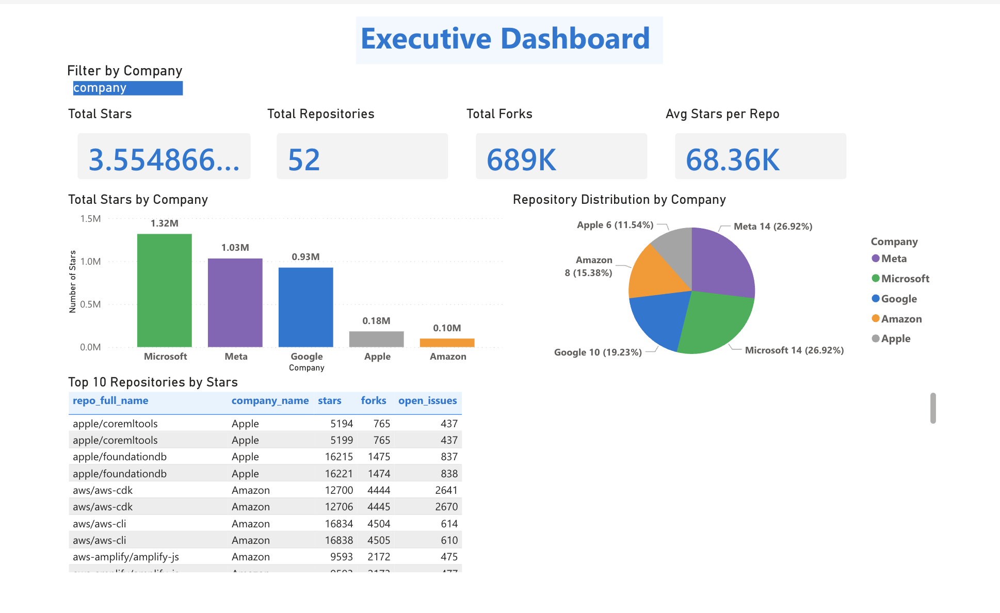

# 📊 Executive Dashboard

**High-level overview of Big 5 companies' open-source market dominance**

## 📈 Key Metrics at a Glance

| Metric | Value | Insight |
|--------|-------|---------|
| **Total Stars** | 3.55M | Community engagement scale |
| **Total Repositories** | 52 | Portfolio size |
| **Total Forks** | 689K | Code reusability |
| **Avg Stars/Repo** | 68.36K | Repository quality |

## 🎯 What This Shows

### Top Companies (by Stars)
1. **Microsoft** 1.32M stars (37%)
2. **Meta** 1.03M stars (29%)
3. **Google** 930K stars (26%)
4. **Apple** 180K stars (5%)
5. **Amazon** 100K stars (3%)

### Repository Distribution
- **Microsoft & Meta** lead with 26-27% each
- **Google** strong at 19%
- **Apple & Amazon** smaller portfolios but strategic focus

## 💡 Key Insights for Recruiters

✅ **Shows**: Data aggregation & visualization skills  
✅ **Demonstrates**: ETL pipeline delivering 3.5M+ stars of real data  
✅ **Proves**: Ability to connect multiple data sources (GitHub API → BigQuery → Power BI)

## 🔗 Access

- **Updated**: Daily at 2:00 AM UTC
- **Data Source**: 52 repositories across 5 companies
- **View Live**: [Power BI Link](#)

---

**Next**: [Language Trends Dashboard](02-language-trends.md)