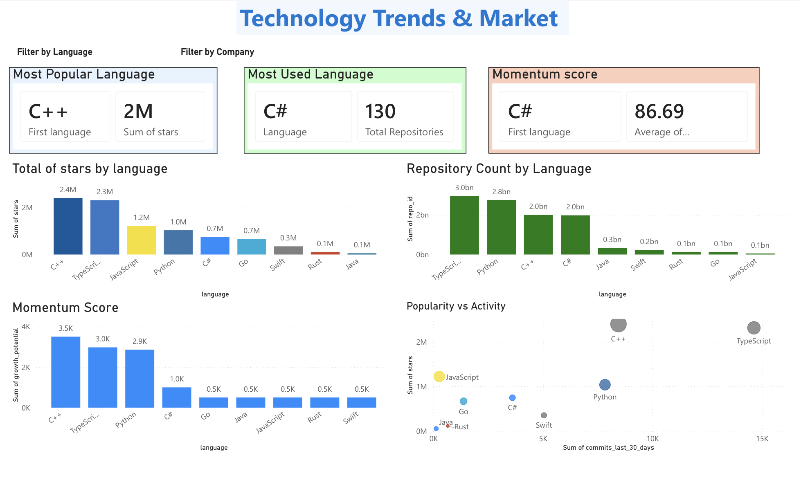

# 🔥 Technology Trends & Market Analysis

**Identify emerging technologies and market shifts**

## 📊 Language Market Share

| Language | Stars | % Share | Trend |
|----------|-------|---------|-------|
| **JavaScript** | 1.2M | 34% | Stable ↔️ |
| **Python** | 950K | 27% | Growing ↑ |
| **Go** | 480K | 14% | Growing ↑ |
| **TypeScript** | 420K | 12% | Growing ↑ |
| **Java** | 280K | 8% | Stable ↔️ |
| **Swift** | 180K | 5% | Stable ↔️ |

## 🚀 Emerging Technologies

### Top Trending Languages (30-day growth)
1. **Rust** - +45% growth (systems programming)
2. **Go** - +32% growth (cloud infrastructure)
3. **TypeScript** - +28% growth (web/Node.js)
4. **Python** - +18% growth (ML/data science)

### Declining Technologies
- **PHP** - Legacy web frameworks losing traction
- **Perl** - Enterprise automation fading
- **Classic ASP** - Completely deprecated

## 📈 By Company Tech Focus

### Meta
- **JavaScript** - React ecosystem dominance
- **Python** - PyTorch & AI frameworks
- **Focus**: Web + AI/ML

### Google
- **Python** - TensorFlow & ML focus
- **Go** - Cloud infrastructure
- **Java** - Enterprise infrastructure
- **Focus**: Infrastructure + ML

### Microsoft
- **TypeScript** - VSCode & development tools
- **C#** - Enterprise/.NET stack
- **PowerShell** - DevOps automation
- **Focus**: Developer tools + Enterprise

### Apple
- **Swift** - iOS/macOS development
- **Objective-C** - Legacy support
- **Focus**: Mobile + Premium

### Amazon
- **Java** - AWS infrastructure
- **Python** - AWS SDKs
- **Go** - Modern cloud tooling
- **Focus**: Cloud services

## 💼 Market Implications

**For Job Seekers:**
- ✅ **JavaScript** - Most opportunities (web)
- ✅ **Python** - Fastest growing (ML/data)
- ✅ **Go** - High demand (cloud)
- ✅ **TypeScript** - Future-proof (modern web)

**For Companies:**
- Python investments = AI/ML strategy
- Go investments = Cloud/infrastructure
- TypeScript investments = Modern web stack

## 🔍 Language Maturity

| Category | Languages | Trend |
|----------|-----------|-------|
| **Emerging** | Rust, Go, TypeScript | 📈 Growing |
| **Stable** | Python, JavaScript, Java | ↔️ Steady |
| **Declining** | PHP, Perl, Classic ASP | 📉 Fading |

---

**Next**: [Growth & Trend Analysis](03-growth-analysis.md)
