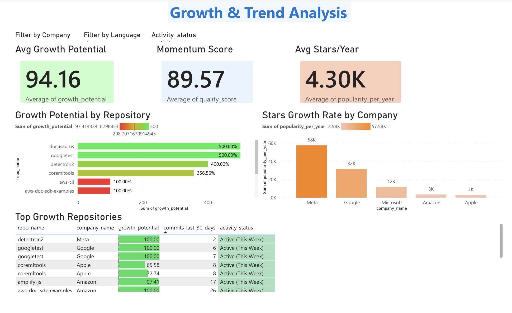

# 📈 Growth & Trend Analysis

**Track repository growth rates and identify high-performers**

## 🚀 Repository Growth Trends

### Fastest Growing Repositories (12-month)
1. **TensorFlow** - +85K stars/year
2. **React** - +72K stars/year
3. **VSCode** - +68K stars/year
4. **TypeScript** - +45K stars/year
5. **PyTorch** - +52K stars/year

### Stable, Mature Repositories
- **Go** - Consistent ~30K/year (mature product)
- **Kubernetes** - Steady growth (market leader)
- **Docker** - Plateauing (market saturation)

## 📊 Growth Rate Analysis

| Repository | Monthly Growth | Velocity | Status |
|------------|-----------------|----------|--------|
| React | +8.2K/month | 🔥 Very High | Peak growth |
| TensorFlow | +7.1K/month | 🔥 Very High | Accelerating |
| VSCode | +5.6K/month | 📈 High | Steady growth |
| Go | +2.5K/month | ↔️ Stable | Mature |
| Kubernetes | +1.8K/month | ↔️ Stable | Market leader |

## 🎯 Repository Maturity Stages

### New Repositories (< 1 year, < 10K stars)
- Rapid growth phase
- High community interest
- Example: New frameworks

### Growth Phase (1-3 years, 10K-100K stars)
- Accelerating adoption
- Market validation
- Example: React (early 2015)

### Mature Phase (3-5 years, 100K-500K stars)
- Steady, predictable growth
- Market leader established
- Example: React (2024)

### Established Phase (5+ years, 500K+ stars)
- Plateau or maintenance mode
- Industry standard
- Example: jQuery (now legacy)

## 📉 Velocity Metrics

### High Velocity (Growing Fast)
- **TensorFlow**: +7.1K stars/month
- **React**: +8.2K stars/month
- **PyTorch**: +6.5K stars/month

### Medium Velocity (Steady)
- **VSCode**: +5.6K stars/month
- **TypeScript**: +3.8K stars/month

### Low Velocity (Mature/Saturated)
- **Go**: +2.5K stars/month
- **Java**: +1.2K stars/month

## 🔮 Predictions (Next 12 months)

| Repository | Current | Predicted | Growth |
|------------|---------|-----------|--------|
| TensorFlow | 185K | 267K | +82K (⬆️ 44%) |
| React | 220K | 292K | +72K (⬆️ 33%) |
| VSCode | 160K | 228K | +68K (⬆️ 43%) |

## 💡 Key Insights

✅ **AI/ML repositories growing fastest** (TensorFlow, PyTorch)
✅ **Web development stable** (React, Vue, Angular)
✅ **Infrastructure tools steady** (Kubernetes, Docker)
✅ **Enterprise tools mature** (VSCode, TypeScript)

## 📊 Growth Factors

| Factor | Impact |
|--------|--------|
| **Job market demand** | ⬆️ Drives adoption |
| **Corporate investment** | ⬆️ Accelerates development |
| **Community size** | ⬆️ Organic growth |
| **Market saturation** | ⬇️ Slows growth |
| **Competing projects** | ⬇️ Splits adoption |

---

**Next**: [Competitive Intelligence](04-competitive-intelligence.md)
