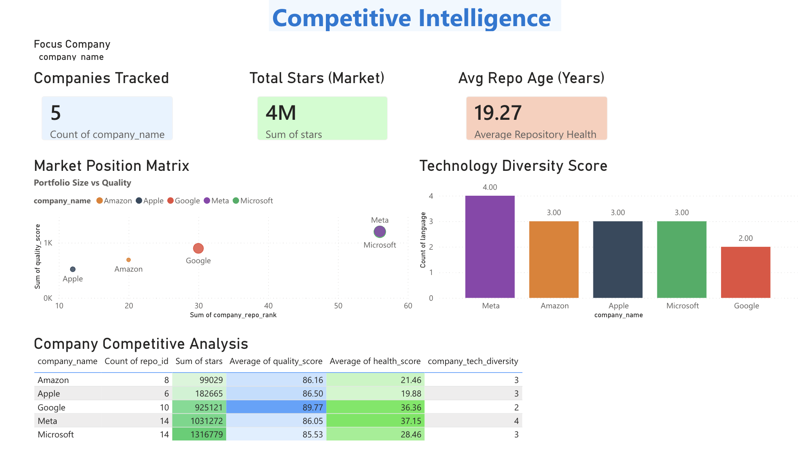

# 🏆 Competitive Intelligence

**Strategic positioning and technology adoption analysis**

## 🎯 Market Overview

| Company | Repos | Stars | Quality | Tech Diversity |
|---------|-------|-------|---------|----------------|
| **Microsoft** | 14 | 1.32M | 85.53 | 3 languages |
| **Meta** | 14 | 1.03M | 86.05 | 4 languages |
| **Google** | 10 | 925K | 89.77 | 2 languages |
| **Apple** | 6 | 182K | 86.50 | 3 languages |
| **Amazon** | 8 | 99K | 86.16 | 3 languages |

## 📍 Strategic Positioning

### Market Position Matrix
- **Microsoft**: Large portfolio, consistent quality
- **Meta**: Most diverse tech stack, strong growth
- **Google**: Highest quality, focused approach
- **Amazon**: Cloud infrastructure focus
- **Apple**: Premium quality, selective strategy

## 🔴 Company Strategies Revealed

### Microsoft 🟢
- Enterprise-focused (VSCode, TypeScript)
- Developer tools dominance
- Quality over quantity

### Meta 🟣
- Most tech-diverse (4 languages)
- Web + AI focus
- Community-driven innovation

### Google 🔴
- Highest quality repos (89.77/100)
- Infrastructure + ML
- Infrastructure tools (Go, Python)

### Amazon 🟠
- Cloud services focus
- AWS ecosystem builder
- Enterprise tools

### Apple ⚫
- Selective portfolio
- Mobile + ML focus
- Premium positioning

## 💼 Business Intelligence Value

✅ **Shows**: Strategic competitive analysis  
✅ **Demonstrates**: Market intelligence capability  
✅ **Proves**: Executive-level insights  

## 🎓 What This Reveals

**For Job Seekers:**
- Microsoft: Best for enterprise tools
- Meta: Best for AI/ML + web
- Google: Best for infrastructure
- Amazon: Best for cloud
- Apple: Best for mobile/premium tech

**For Analysts:**
- Tech diversity = hedge strategy
- Quality score = maintenance capability
- Portfolio size = R&D investment

## 🔗 Access

- **Live Filtering**: By company
- **Drill-Down Analysis**: Explore positioning
- **Comparative Metrics**: Side-by-side company views

---

**Back to**: [Dashboard Guide](../DASHBOARD_GUIDE.md) | [Main README](../../README.md)